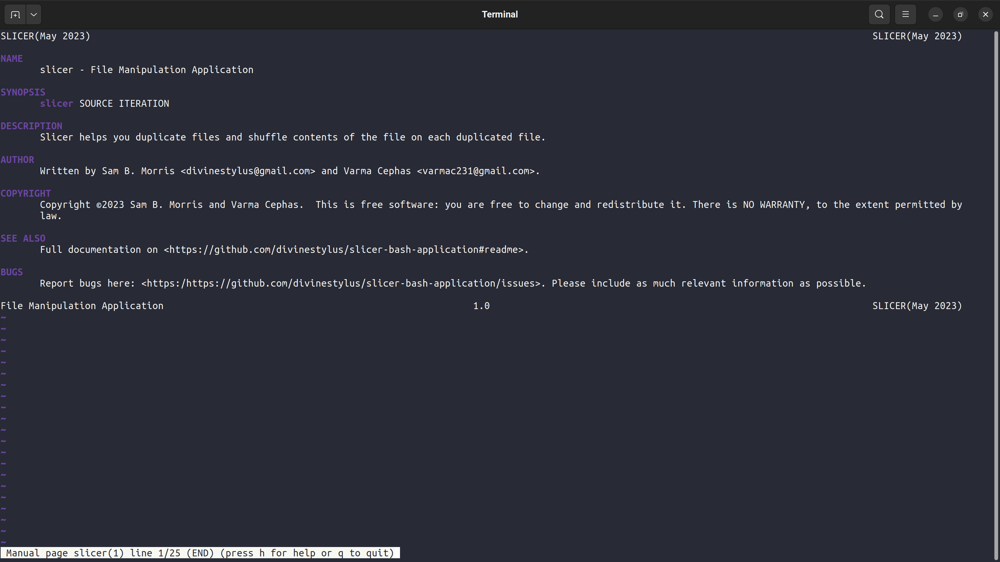

## Overview
#### [Slicer](https://github.com/divinestylus/slicer) - File Manipulation App
###### Sicer is a command line file manipulation application.

## Features
#### Copy & shuffle
###### Copy & shuffle is primarily designed as an evalution tool. Instructors & facilitators can highly benefit from it's immense power. With a single copy of assessment questions, slicer duplicates the questions into desired number of copies, while shuffling the questions, making each copy unique.

## How to install
> 1. Download the installation package [slicer.deb](https://github.com/divinestylus/slicer/blob/main/slicer.deb)


> 2. Run command 
```.sh
sudo dpkg -i slicer.deb  # Make sure the argument's "$filepath" is properly specified 
```

> 3. Read the man page for proper usage
```.sh
man slicer
```

<hr>

###### &copy; 2023 | Designed & Developed by [Sam B. Morris](https://github.com/divinestylus) and [Varma Cephas](https://github.com/varma-cephas)
